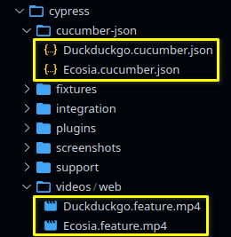
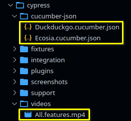

[](https://github.com/prettier/prettier)

# BDD base project: Cypress + Cucumber + Typescript

Basic example of using Cypress with Cucumber (BDD). This `Gherkin` example includes:
- Basic Scenario
- Scenario Outline
- Tagged tests

*base project*: [cypress-cucumber-preprocessor](https://www.npmjs.com/package/cypress-cucumber-preprocessor)

# Table of contents

* [Get started](#get-started)
  * [Installation](#installation)
* [How to run the tests](#how-to-run-the-tests)
  * [Running tests](#running-tests)
  * [Running tagged tests](#running-tagged-tests)
    * [Running tagged smoke tests](#running-tagged-smoke-tests)
    * [Running using customized tags](#running-using-customized-tags)
  * [Bundled features files](#bundled-features-files)
* [Static code analysis tools](#static-code-analysis-tools)
  * [How to run the tools](#how-to-run-the-tools)
  * [ESLint](#eslint)
    * [Find Problems](#find-problems)
    * [Fix Automatically](#fix-automatically)
  * [TypeScript Compiler](#typescript-compiler)
    * [Checking code without compilation](#checking-code-without-compilation)
* [Issues](#issues)
* [License](#license)
* [Changelog](#changelog)

# Get started

## Installation

```bash
npm install
```

# How to run the tests

## Running tests

```bash
npm test
```

**`output`**: an output is generated for each `.feature` file found.

```bash
    Spec                                              Tests  Passing  Failing  Pending  Skipped
┌────────────────────────────────────────────────────────────────────────────────────────────────┐
│ ✔  web/Duckduckgo.feature                  00:20        3        3        -        -        -  │
├────────────────────────────────────────────────────────────────────────────────────────────────┤
│ ✔  web/Ecosia.feature                      00:40        3        3        -        -        -  │
└────────────────────────────────────────────────────────────────────────────────────────────────┘
  ✔  All specs passed!                       01:00        6        6        -        -        -
```



## Running tagged tests

### Running tagged smoke tests

```bash
# defined in package.json file
npm run tag:smoke
```

### Running using customized tags

```bash
./node_modules/.bin/cypress-tags run -e TAGS='not @foo and (@bar or @zap)'
```

*more details*: [running-tagged-tests](https://www.npmjs.com/package/cypress-cucumber-preprocessor#running-tagged-tests)

## Bundled features files

When running Cypress tests in a headless mode, the execution time can get pretty bloated, this
happens because by default Cypress will relaunch the browser between every feature file. The
**cypress-cucumber-preprocessor** gives you the option to bundle all feature files before running
the tests, therefore reducing the execution time.

You can take advantage of this by creating `.features` files. You choose to have only one in the root
of the directory `cypress/integrations` or per directory.

You also have to add support for `.features` files to your Cypress configuration

*cypress.json*

```json
{
  "testFiles": ["**/*.{feature,features}"]
}
```

To run the bundled tests:

```bash
npm run bundled:all  # cypress run --spec **/*.features
```

**`output`**: only one output is generated for all `.feature` files found.

```bash
    Spec                                              Tests  Passing  Failing  Pending  Skipped
┌────────────────────────────────────────────────────────────────────────────────────────────────┐
│ ✔  All.features                            00:57        6        6        -        -        -  │
└────────────────────────────────────────────────────────────────────────────────────────────────┘
  ✔  All specs passed!                       00:57        6        6        -        -        -
```



# Static code analysis tools

## How to run the tools

Run ESLint and TypeScript Compiler (without compilation)

```bash
npm run lint
```

## ESLint

### Find Problems

ESLint statically analyzes the code to find problems.

```bash
npm run lint:eslint
```

### Fix Automatically

Many problems ESLint finds can be automatically fixed.

```bash
npm run lint:eslint:fix
```

## TypeScript Compiler

### Checking code without compilation

Check the types and validate the code using TypeScript without compilation.

```bash
npm run lint:tsc
```

# Issues

*github*: [see full list](https://github.com/TheBrainFamily/cypress-cucumber-preprocessor/issues)

# License

[MIT](./LICENSE)

# Changelog

- 1.0.0 - Initial version.
